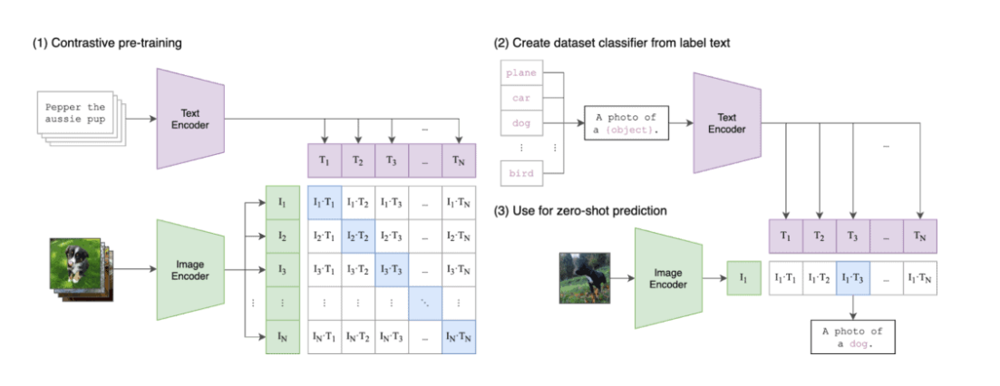

# DeepERA
Learn: Deep learning, Pytorch, Computer Vision, NLP, Transformers, Pytorch Lightning

## S19
**Objective: Explore CLip Model.**

CLIP (Contrastive Language-Image Pre-training) is a model developed by OpenAI that leverages large-scale pre-training on both image and text data to understand the relationship between the two modalities. Unlike traditional computer vision models that rely solely on images or NLP models that process only text, CLIP is trained to associate images and their corresponding textual descriptions in a multimodal framework.

Applications of CLIP:

1. Zero-shot image classification
2. Fine-Tuned Image Classification
3. Semantic Image Retrieval
4. Content Moderation
5. Image Ranking
6. Image Captioning
7. Deciphering Blurred Image
8. Reverse Image Search

HuggingFace App for image captioning: https://huggingface.co/spaces/Vasudevakrishna/ERAV1_Clip_S19

Please go through the code and comments to get deeper intuitions.