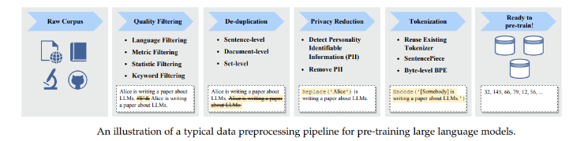

# DeepERA
Learn: Deep learning, Pytorch, Computer Vision, NLP, Transformers, Pytorch Lightning

## S28
**Objective: Know how to pretrain-train the LLM.**
Used : Redpajama dataset 
Size: 80MB(Only Books and Papers)

Referred: [Link](https://wandb.ai/wandb_gen/llm-data-processing/reports/Processing-Data-for-Large-Language-Models--VmlldzozMDg4MTM2)

PipeLine:

Please go through the code and comments to get deeper intuitions.