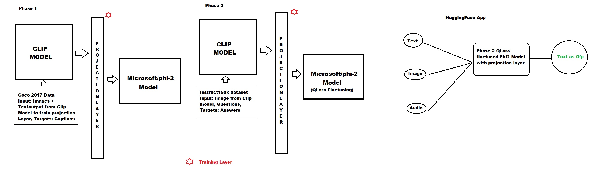

# DeepERA
Learn: Deep learning, Pytorch, Computer Vision, NLP, Transformers, Pytorch Lightning

## S20
**Objective: Create a Multimodel GPT(Audio, Text, Image).**

Constraints:
Input as:
1. Text
2. Image
3. Audio 
The output remains text for us. Here are the guidelines:

Training:
1. Image:
Use the original Instruct 150k dataset, and use CLIP to get the image embeddings:
either run it in real-time (need more GPU), or
store the embeddings (basically preprocess and store)
Add your projection layer from this CLIP embeddings to something that can be fed to your Phi Model (do not apply QLoRa to this payer)
Add an adapter that you'll train (QLoRa) on the instruct 150k dataset
2. Audio:
You need to use Whisper to perform ASR. 
Add a projection layer for whisper output (which is text only)
This audio part "should" not require any training, but a pipeline from your end to link it properly to your model
3. Text 
QLora on Phi2.

Deployment:
Your deployment page should look like ChatGPT only, where you can send in images, text, or upload audio (live recording or file)

The task is devided into 2. Please go through below:

I have completed phase 1, which took 2 days on 48GB GPU on RTX6000Ada(128GB RAM). Results are quite good.